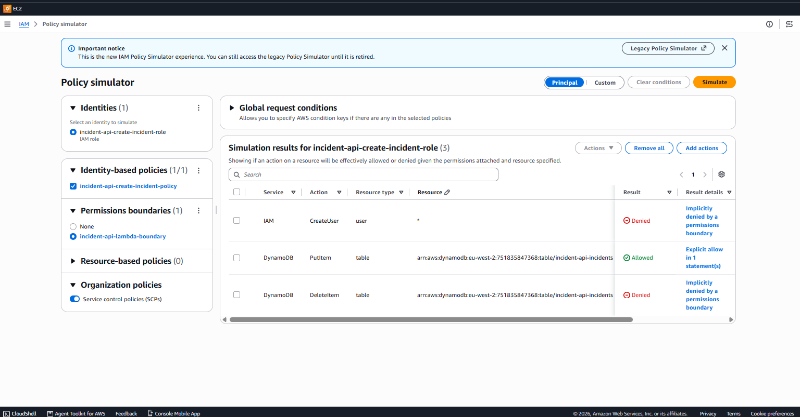

# Serverless Incident API

A small, serverless REST API for logging infrastructure incidents (device alerts such as "uplink down" or "disk 92% full"), built on **API Gateway (HTTP API) → Lambda (Python) → DynamoDB** and deployed entirely with **Terraform** in `eu-west-2`.

The functionality is deliberately simple. The focus is on **least-privilege IAM design**: every function has its own role with exactly one DynamoDB action, and every role is capped by a **permissions boundary**, so a mistake in the Terraform can't produce an over-privileged role.

---

## Architecture

```
                    ┌──────────────────────── API Gateway (HTTP API, $default stage) ───────────────────────┐
                    │           throttled: 10 req/s, burst 20  ·  no auth (lab)                              │
 client ── HTTPS ──▶│  POST /incidents        GET /incidents          GET /incidents/{id}                    │
                    └───────┬──────────────────────┬─────────────────────────┬───────────────────────────────┘
                            ▼                      ▼                         ▼
                   incident-api-create-   incident-api-list-      incident-api-get-
                   incident (Lambda)      incidents (Lambda)      incident (Lambda)
                            │ PutItem              │ Scan                    │ GetItem
                            └──────────────────────┼─────────────────────────┘
                                                   ▼
                                  DynamoDB: incident-api-incidents
                                  (on-demand, hash key: incident_id)

 Each Lambda → its own IAM role → inline policy (1 DynamoDB action + own log group)
                                → permissions boundary: incident-api-lambda-boundary
 Each Lambda → its own CloudWatch log group (3-day retention)
```

| Route | Lambda | DynamoDB action | Success |
|---|---|---|---|
| `POST /incidents` | `incident-api-create-incident` | `PutItem` | `201` + created incident |
| `GET /incidents` | `incident-api-list-incidents` | `Scan` (limit 50, newest first) | `200` + `{count, incidents}` |
| `GET /incidents/{id}` | `incident-api-get-incident` | `GetItem` | `200` + incident, or `404` |

## Security design

**1. One role per function, one action per role.** Rather than sharing a single "Lambda role", each function gets its own role, whose inline policy grants exactly one DynamoDB action on the one table ARN, plus `logs:CreateLogStream`/`logs:PutLogEvents` on its own log group. The create function can't read, and the read functions can't write.

**2. Permissions boundary on every role.** All three roles carry `incident-api-lambda-boundary`. The deploying IAM user (`cloud-engineer-project-policy`) is only allowed to create `incident-api-*` roles *with that boundary attached*. So even if someone later widened an inline policy to `dynamodb:*` or `iam:*`, the boundary would still cap the role at table + log access. The boundary and the deployer policy are managed outside this stack, so they survive `terraform destroy`.

**3. Route-scoped invoke permissions.** Each `aws_lambda_permission` uses a `source_arn` tied to that function's own route, so for example `create_incident` can't be invoked through `GET /incidents`.

**4. Cost and abuse guardrails.** The API is public with no auth (it's a lab), so the stage is throttled to 10 req/s with a burst of 20. DynamoDB is on-demand (costs nothing while idle), and log groups are pre-created with 3-day retention rather than Lambda's default of "never expire". Pre-creating the log groups also means no role needs `logs:CreateLogGroup`.

### Verified with the IAM Policy Simulator

Simulating `incident-api-create-incident-role` with its inline policy **and** the boundary against the live table ARN:

| Action | Resource | Result | Reason |
|---|---|---|---|
| `dynamodb:PutItem` | `table/incident-api-incidents` | ✅ Allowed | Explicit allow in 1 statement |
| `dynamodb:DeleteItem` | `table/incident-api-incidents` | ⛔ Denied | Implicitly denied by a permissions boundary |
| `iam:CreateUser` | `*` | ⛔ Denied | Implicitly denied by a permissions boundary |



## Deploy

Prerequisites: Terraform ≥ 1.5, AWS CLI credentials for a user allowed to deploy `incident-api-*` resources, and the `incident-api-lambda-boundary` policy already in the account.

```powershell
cd terraform
terraform init
terraform plan
terraform apply      # 24 resources
```

`terraform output next_steps` prints ready-to-run test commands for the deployed endpoint.

## Usage

```powershell
$api = terraform output -raw api_endpoint

# Create
Invoke-RestMethod -Uri "$api/incidents" -Method Post -ContentType "application/json" `
  -Body '{"device":"core-sw-01","severity":"critical","message":"Uplink port Gi1/0/48 down"}'

# List
Invoke-RestMethod -Uri "$api/incidents"

# Get one
Invoke-RestMethod -Uri "$api/incidents/<incident_id>"
```

Request body for `POST /incidents`:

| Field | Required | Values |
|---|---|---|
| `device` | yes | any string |
| `severity` | yes | `info`, `warning`, `critical` |
| `message` | yes | any string |

The server adds `incident_id` (UUID) and `timestamp` (UTC ISO-8601). Invalid JSON, missing fields, or an unknown severity returns `400`.

### Live test output

Captured against the deployed stack on 27 Sep 2026 (raw log: [`docs/live-test.txt`](docs/live-test.txt)):

| Test | Expected | Got | Handled by |
|---|---|---|---|
| `POST /incidents` (valid body) | 201 | **201**: incident with generated `incident_id` + UTC `timestamp` | create Lambda |
| `GET /incidents/{id}` | 200 | **200**: same incident read back | get Lambda |
| `GET /incidents` | 200 | **200**: `count: 2`, newest first | list Lambda |
| `POST` with `severity: "urgent"` | 400 | **400**: `severity must be one of: info, warning, critical` | create Lambda validation |
| `POST` missing fields | 400 | **400**: `device, severity, and message are required` | create Lambda validation |
| `GET /incidents/does-not-exist` | 404 | **404**: `Incident does-not-exist not found` | get Lambda |
| `DELETE /incidents/{id}` | 404 | **404**: `Not Found` | API Gateway: no such route, Lambda never invoked |

```text
### POST valid
HTTP 201
{"incident_id": "3c7d6396-81a3-4cdd-9361-51101e4946b2", "device": "core-sw-01", "severity": "critical",
 "message": "Uplink port Gi1/0/48 down", "timestamp": "2026-09-27T05:14:11.023043+00:00"}

### GET list
HTTP 200
{"count": 2, "incidents": [{"device": "core-sw-01", "severity": "critical", "message": "Uplink port Gi1/0/48 down", ...},
                           {"device": "rds-broker-01", "severity": "critical", "message": "connection pool exhausted", ...}]}
```

The `DELETE` result is worth noting. There is no delete route, so API Gateway rejects the request itself, and even if one were added, no role has `DeleteItem` (confirmed in the simulator above).

## Project layout

```
serverless-incident-api/
├── lambda/
│   ├── create_incident.py     # POST /incidents  – validates + PutItem
│   ├── list_incidents.py      # GET  /incidents  – Scan (limit 50), newest first
│   └── get_incident.py        # GET  /incidents/{id} – GetItem, 404 if missing
├── terraform/
│   ├── variables.tf           # providers, region (eu-west-2), project_name, runtime
│   ├── dynamodb.tf            # on-demand table
│   ├── lambda.tf              # function map, zips, log groups, functions
│   ├── iam.tf                 # per-function roles + boundary + scoped policies
│   ├── apigateway.tf          # HTTP API, throttled stage, routes, invoke permissions
│   └── outputs.tf             # endpoint, names, next_steps
└── docs/
    ├── iam-policy-simulator.png
    └── live-test.txt          # raw output of the live API tests
```

Everything is driven by one `locals.functions` map in `lambda.tf`. Adding a route means adding one entry (file, handler, route, DynamoDB actions), and the role, policy, log group, function, integration, route and permission are all generated from it.

## Teardown

```powershell
cd terraform
terraform destroy    # removes all 24 resources
```

The permissions boundary and the deployer's IAM policy live outside this stack and are intentionally left in place.

## Known limitations and next steps

- **No authentication.** The next step would be a JWT authorizer (Cognito) or IAM auth on the routes.
- **`Scan` with `Limit=50` and no pagination.** Fine for a lab. For real use, add a GSI (e.g. on `severity` + `timestamp`) and `Query` it, and return `LastEvaluatedKey` for paging.
- **Local Terraform state.** Move to an S3 backend with DynamoDB locking for team use.
- **No update or delete route.** Incidents are append-only by design here. Resolving them would add `PATCH /incidents/{id}` with its own `UpdateItem`-only role.
- **No automated tests or CI.** Add pytest with moto for the handlers, and a `terraform validate`/`tflint` step in GitHub Actions.

## Cost

Built and torn down in a single session. With on-demand DynamoDB, Lambda and HTTP API pricing, and only a handful of test requests, the cost is effectively $0 (well within free tier).
